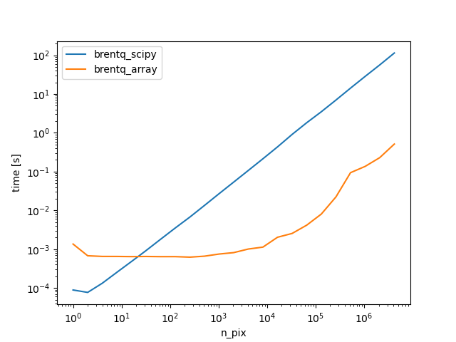

# Array Brentq
An array based implementation of Brent's method. It is checked for correctness against Scipy's implementation
in the file `test_brentq_array.py`.

# Some Notes
- The implementation relies on the [Python Array API](https://data-apis.org/array-api/2022.12/).
- I offered to contribute this to Scipy: https://github.com/scipy/scipy/issues/19354. Here is the related issue: https://github.com/scipy/scipy/issues/7242
- Scipy currently (Oct 2023) has a private implementatiom of Chandrupatla's method (https://github.com/scipy/scipy/blob/166e1f2b1ea0a1a2c3d7b030bd829549f8a5844a/scipy/optimize/_zeros_py.py#L1789), which I have not tested yet. 

# Benchmark
This is a benchmark of the array based implementation of Brent's method agains the naive Python loop and using Scipy's implementation. The benchmark was executed on an M1 Macbook Pro with 16GB of RAM. 

